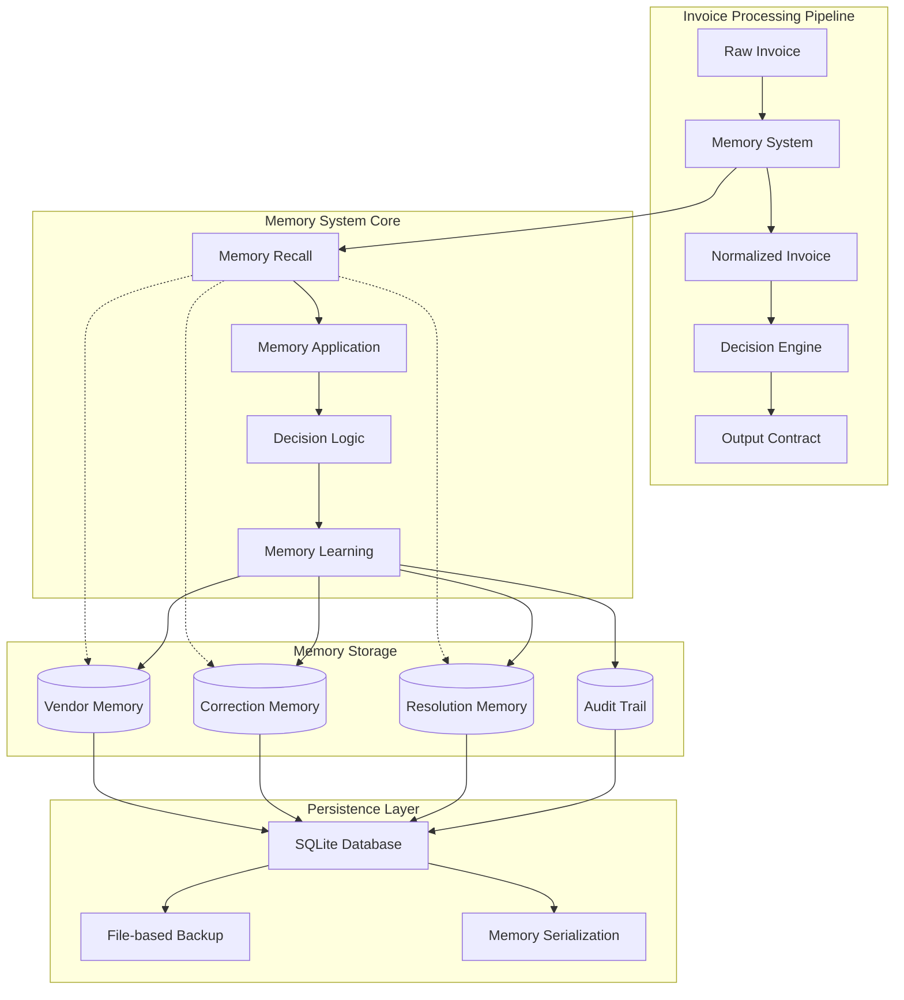
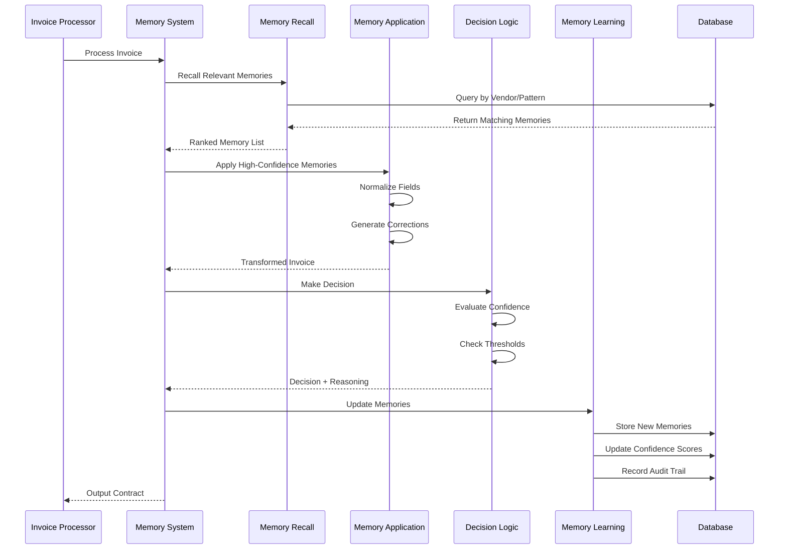

# Design Document: AI Agent Memory System

## Overview

The AI Agent Memory System is a TypeScript-based learning layer that enhances invoice processing automation by storing and applying insights from past processing experiences. The system implements a confidence-based memory architecture that learns from vendor patterns, human corrections, and resolution outcomes to progressively reduce manual review requirements while maintaining explainability and auditability.

The system operates on three core memory types: Vendor Memory (vendor-specific patterns), Correction Memory (learned from human corrections), and Resolution Memory (tracking decision outcomes). Each memory maintains a confidence score that evolves through reinforcement and decay mechanisms, ensuring reliable patterns strengthen while unreliable ones weaken over time.

## Architecture

### High-Level Architecture



### Memory Processing Flow



## Components and Interfaces

### Core Memory System Interface

```typescript
interface MemorySystem {
  processInvoice(invoice: RawInvoice): Promise<ProcessingResult>;
  recallMemories(context: InvoiceContext): Promise<Memory[]>;
  applyMemories(invoice: RawInvoice, memories: Memory[]): Promise<NormalizedInvoice>;
  makeDecision(invoice: NormalizedInvoice, confidence: number): Promise<Decision>;
  learnFromOutcome(outcome: ProcessingOutcome): Promise<void>;
}

interface ProcessingResult {
  normalizedInvoice: NormalizedInvoice;
  proposedCorrections: Correction[];
  requiresHumanReview: boolean;
  reasoning: string;
  confidenceScore: number;
  memoryUpdates: MemoryUpdate[];
  auditTrail: AuditStep[];
}
```

### Memory Types and Structures

```typescript
interface Memory {
  id: string;
  type: MemoryType;
  pattern: MemoryPattern;
  confidence: number;
  createdAt: Date;
  lastUsed: Date;
  usageCount: number;
  successRate: number;
  context: MemoryContext;
}

enum MemoryType {
  VENDOR = 'vendor',
  CORRECTION = 'correction',
  RESOLUTION = 'resolution'
}

interface VendorMemory extends Memory {
  vendorId: string;
  fieldMappings: FieldMapping[];
  vatBehavior: VATBehavior;
  currencyPatterns: CurrencyPattern[];
  dateFormats: DateFormat[];
}

interface CorrectionMemory extends Memory {
  correctionType: CorrectionType;
  triggerConditions: Condition[];
  correctionAction: CorrectionAction;
  validationRules: ValidationRule[];
}

interface ResolutionMemory extends Memory {
  discrepancyType: DiscrepancyType;
  resolutionOutcome: ResolutionOutcome;
  humanDecision: HumanDecision;
  contextFactors: ContextFactor[];
}
```

### Confidence Management System

```typescript
interface ConfidenceManager {
  calculateInitialConfidence(memory: Memory): number;
  reinforceMemory(memory: Memory, outcome: Outcome): number;
  decayMemory(memory: Memory, timeSinceLastUse: number): number;
  evaluateMemoryReliability(memory: Memory): ReliabilityScore;
  adjustEscalationThreshold(performanceMetrics: PerformanceMetrics): number;
}

interface ConfidenceCalculation {
  baseConfidence: number;
  reinforcementFactor: number;
  decayFactor: number;
  reliabilityBonus: number;
  contextualAdjustment: number;
  finalConfidence: number;
}
```

### Persistence Layer

```typescript
interface MemoryRepository {
  saveMemory(memory: Memory): Promise<void>;
  findMemoriesByVendor(vendorId: string): Promise<Memory[]>;
  findMemoriesByPattern(pattern: MemoryPattern): Promise<Memory[]>;
  updateConfidence(memoryId: string, confidence: number): Promise<void>;
  archiveMemory(memoryId: string): Promise<void>;
  getMemoryHistory(memoryId: string): Promise<MemoryHistoryEntry[]>;
}

interface AuditRepository {
  recordAuditStep(step: AuditStep): Promise<void>;
  getAuditTrail(invoiceId: string): Promise<AuditStep[]>;
  generateAuditReport(criteria: AuditCriteria): Promise<AuditReport>;
}
```

## Data Models

### Invoice Data Models

```typescript
interface RawInvoice {
  id: string;
  vendorId: string;
  invoiceNumber: string;
  rawText: string;
  extractedFields: ExtractedField[];
  metadata: InvoiceMetadata;
}

interface NormalizedInvoice {
  id: string;
  vendorId: string;
  invoiceNumber: string;
  serviceDate?: Date;
  invoiceDate: Date;
  dueDate?: Date;
  totalAmount: Money;
  vatAmount?: Money;
  currency: string;
  lineItems: LineItem[];
  paymentTerms?: PaymentTerms;
  purchaseOrderNumber?: string;
  normalizedFields: NormalizedField[];
}

interface LineItem {
  description: string;
  quantity: number;
  unitPrice: Money;
  totalPrice: Money;
  sku?: string;
  vatRate?: number;
}
```

### Memory Pattern Models

```typescript
interface FieldMapping {
  sourceField: string;
  targetField: string;
  transformationRule?: TransformationRule;
  confidence: number;
  examples: MappingExample[];
}

interface TransformationRule {
  type: TransformationType;
  parameters: Record<string, any>;
  validationPattern?: RegExp;
}

enum TransformationType {
  DIRECT_MAPPING = 'direct',
  DATE_PARSING = 'date_parse',
  CURRENCY_EXTRACTION = 'currency_extract',
  TEXT_NORMALIZATION = 'text_normalize',
  REGEX_EXTRACTION = 'regex_extract'
}
```

### Confidence and Learning Models

```typescript
interface ConfidenceEvolution {
  memoryId: string;
  timestamp: Date;
  previousConfidence: number;
  newConfidence: number;
  trigger: ConfidenceTrigger;
  reasoning: string;
}

enum ConfidenceTrigger {
  SUCCESSFUL_APPLICATION = 'success',
  FAILED_APPLICATION = 'failure',
  HUMAN_VALIDATION = 'validation',
  TIME_DECAY = 'decay',
  PATTERN_REINFORCEMENT = 'reinforcement'
}

interface LearningMetrics {
  totalMemories: number;
  averageConfidence: number;
  successRate: number;
  automationRate: number;
  humanReviewRate: number;
  memoryUtilization: number;
}
```

## Error Handling

### Error Classification and Recovery

The system implements a comprehensive error handling strategy that maintains system stability while preserving learning capabilities:

**Memory Corruption Handling:**
- Automatic detection of corrupted memory entries through checksum validation
- Graceful degradation to backup memories or default processing
- Quarantine system for suspicious memories pending manual review
- Automatic recovery from backup persistence stores

**Confidence Calculation Errors:**
- Fallback to conservative confidence scores when calculation fails
- Logging of confidence calculation anomalies for system monitoring
- Automatic recalibration of confidence algorithms based on performance metrics
- Circuit breaker pattern for confidence systems showing consistent failures

**Database Connection Failures:**
- In-memory fallback mode for temporary database unavailability
- Automatic retry mechanisms with exponential backoff
- Transaction rollback and recovery for partial memory updates
- Graceful degradation to read-only mode when write operations fail

**Memory Application Errors:**
- Rollback to original invoice state when memory application fails
- Automatic flagging of problematic memories for review
- Alternative memory selection when primary memories fail
- Comprehensive error logging for debugging and system improvement

### Error Recovery Strategies

```typescript
interface ErrorRecoveryStrategy {
  handleMemoryCorruption(corruptedMemory: Memory): Promise<RecoveryResult>;
  handleDatabaseFailure(operation: DatabaseOperation): Promise<FallbackResult>;
  handleConfidenceCalculationError(memory: Memory): Promise<SafeConfidence>;
  handleMemoryApplicationError(memory: Memory, invoice: RawInvoice): Promise<FallbackProcessing>;
}

interface RecoveryResult {
  success: boolean;
  fallbackMemory?: Memory;
  requiresManualReview: boolean;
  errorDetails: string;
}
```

## Testing Strategy

### Dual Testing Approach

The system employs both unit testing and property-based testing to ensure comprehensive coverage and correctness validation:

**Unit Testing Focus:**
- Specific vendor pattern examples (Supplier GmbH, Parts AG, Freight & Co)
- Edge cases in confidence calculation algorithms
- Database connection failure scenarios
- Memory corruption detection and recovery
- Integration points between memory components
- Error handling and fallback mechanisms

**Property-Based Testing Focus:**
- Universal properties that hold across all memory operations
- Confidence score evolution properties
- Memory persistence and retrieval consistency
- Audit trail completeness and accuracy
- System behavior under various input distributions
- Memory application idempotency and consistency

**Property-Based Testing Configuration:**
- Minimum 100 iterations per property test using fast-check library
- Each property test tagged with format: **Feature: ai-agent-memory-system, Property {number}: {property_text}**
- Comprehensive input generation covering edge cases and realistic scenarios
- Shrinking capabilities to identify minimal failing examples
- Integration with CI/CD pipeline for continuous validation

**Testing Libraries and Tools:**
- **Jest** for unit testing framework
- **fast-check** for property-based testing
- **@testcontainers/sqlite** for database integration testing
- **supertest** for API endpoint testing
- **nock** for external service mocking

The testing strategy ensures that both concrete examples work correctly (unit tests) and universal correctness properties hold across all possible inputs (property tests), providing confidence in system reliability and correctness.

## Correctness Properties

*A property is a characteristic or behavior that should hold true across all valid executions of a system—essentially, a formal statement about what the system should do. Properties serve as the bridge between human-readable specifications and machine-verifiable correctness guarantees.*

Based on the requirements analysis, the following correctness properties ensure the memory system operates reliably across all scenarios:

### Property 1: Memory Persistence Round-Trip Consistency
*For any* memory system state, persisting the state then restoring it should produce an equivalent memory system state with all memories, confidence scores, and audit trails intact.
**Validates: Requirements 1.1, 1.2**

### Property 2: Vendor Memory Isolation
*For any* set of vendors and their associated memories, memories from different vendors should never interfere with each other, and querying memories for a specific vendor should only return memories associated with that vendor.
**Validates: Requirements 2.5**

### Property 3: Confidence-Based Decision Consistency
*For any* memory with a confidence score, if the confidence is above the escalation threshold, the system should auto-apply the memory; if below the threshold, it should escalate for human review.
**Validates: Requirements 6.1, 6.2**

### Property 4: Confidence Evolution Based on Outcomes
*For any* memory and processing outcome, successful applications should increase confidence, failed applications should decrease confidence significantly, and unused memories should decay over time.
**Validates: Requirements 7.1, 7.2, 7.3**

### Property 5: Memory Learning from Corrections
*For any* human correction applied to an invoice, the system should store the correction pattern as a new memory or reinforce an existing memory, making the same correction more likely in similar future scenarios.
**Validates: Requirements 3.1, 3.2, 9.2**

### Property 6: Highest Confidence Memory Selection
*For any* set of conflicting memories applicable to the same invoice context, the system should apply the memory with the highest confidence score.
**Validates: Requirements 2.4, 5.3**

### Property 7: Complete Audit Trail Generation
*For any* invoice processing operation, the system should generate a complete audit trail with timestamped entries for every step (recall, apply, decide, learn) performed during processing.
**Validates: Requirements 4.5, 8.7, 12.2**

### Property 8: Output Contract Compliance
*For any* processed invoice, the system output should contain all required fields (normalizedInvoice, proposedCorrections, requiresHumanReview, reasoning, confidenceScore, memoryUpdates, auditTrail) in the specified JSON format.
**Validates: Requirements 8.1, 8.2, 8.3, 8.4, 8.5, 8.6, 8.7**

### Property 9: Reasoning Provision for All Decisions
*For any* memory application, correction suggestion, or escalation decision, the system should provide clear, detailed reasoning explaining why the action was taken.
**Validates: Requirements 3.5, 5.4, 12.1, 12.4**

### Property 10: Memory Retrieval Relevance
*For any* invoice processing request, all recalled memories should be relevant to the invoice context (matching vendor, pattern, or similar characteristics), and memories should be ranked by confidence and relevance.
**Validates: Requirements 5.1, 5.2**

### Property 11: Duplicate Invoice Detection
*For any* pair of invoices from the same vendor with identical invoice numbers and dates within a proximity threshold, the system should flag them as potential duplicates.
**Validates: Requirements 10.7**

### Property 12: Learning Progression Over Time
*For any* vendor with multiple processed invoices, subsequent invoices should demonstrate measurably fewer escalations and higher automation rates as the system learns vendor patterns.
**Validates: Requirements 9.3, 9.4**

### Property 13: Error Handling Graceful Degradation
*For any* corrupted memory data or system error, the system should handle the error gracefully without crashing, maintain system stability, and continue processing with fallback mechanisms.
**Validates: Requirements 1.4, 11.5**

### Property 14: Concurrent Access Data Integrity
*For any* concurrent memory operations (read/write/update), the system should maintain data integrity without race conditions or data corruption.
**Validates: Requirements 1.5**

### Property 15: Poor Performance Memory Suppression
*For any* memory with consistently poor performance (low success rate over multiple applications), the system should reduce its influence on decisions or archive it when confidence falls below minimum thresholds.
**Validates: Requirements 6.5, 7.5**